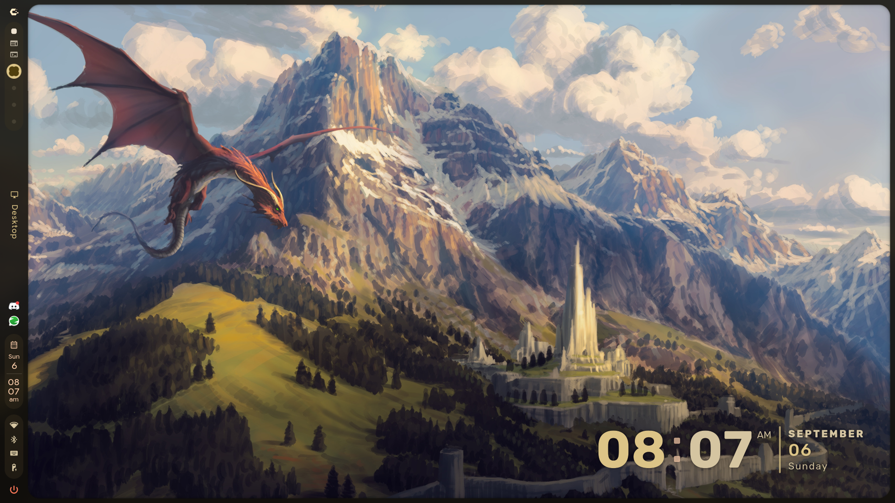
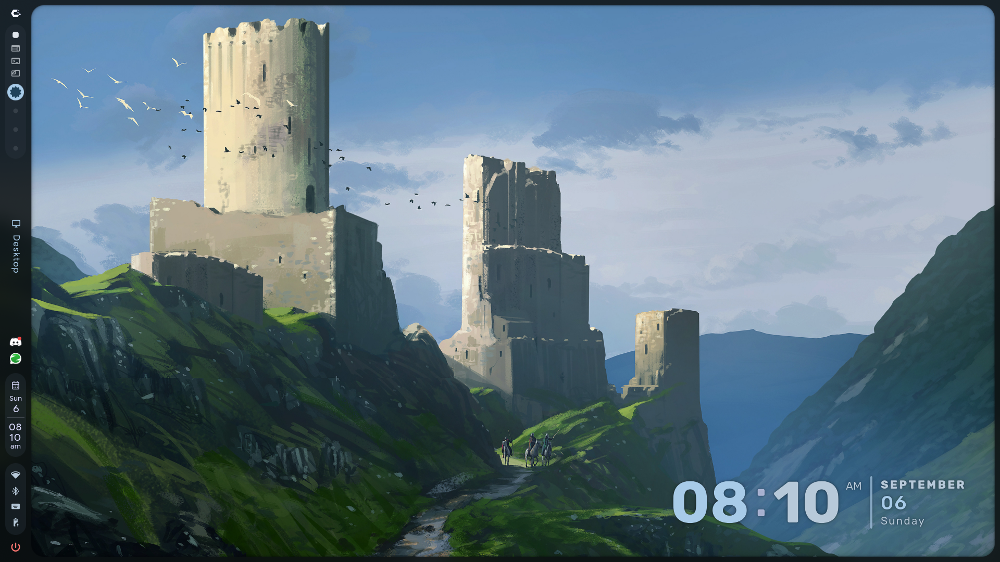

# CachyOS Setup

Personal backup and restoration setup for my **CachyOS + Hyprland + Caelestia** environment.

This repository contains my installed package lists, desktop configurations, dotfiles, fonts, cursor theme, and setup scripts so I can reproduce my preferred Linux environment on another PC.

## 🖥️ Setup Preview





---

## 🖥️ Current Environment

- **OS:** CachyOS
- **Desktop Environment:** Hyprland
- **Shell (desktop):** Caelestia Shell
- **Terminal:** Kitty / Foot
- **Login Shell:** Fish
- **Cursor:** Bibata-Modern-Ice
- **Browser:** Google Chrome
- **Package Manager:** pacman
- **AUR Helper:** paru
- **Flatpak:** Supported

---

## 📁 Repository Structure

```text
cachyos-setup/
│
├── assets/
│   ├── Bibata-Modern-Ice/
│   │   ├── cursor.theme
│   │   └── index.theme
│   │
│   └── fonts/
│       └── JetBrainsMono/
│
├── configs/
│   │
│   ├── caelestia/
│   ├── hypr/
│   ├── kitty/
│   ├── foot/
│   ├── waybar/
│   ├── rofi/
│   ├── fastfetch/
│   ├── fish/
│   └── git/
│
├── dotfiles/
│   └── .gitconfig
│
├── packages/
│   ├── pacman-packages.txt
│   ├── aur-packages.txt
│   └── flatpak-packages.txt
│
├── dotfiles.conf
├── backup.sh
├── install.sh
├── .gitignore
└── README.md
```

> `backup.log` / `install.log` are created next to the scripts on a real
> run and are git-ignored — they never get committed.

---

## ⚙️ `dotfiles.conf` — single source of truth

Both `backup.sh` and `install.sh` read their list of what to back up /
restore from `dotfiles.conf`. Nothing is hardcoded inside either script,
so this is the **only** file you edit to add or remove something.

```bash
# Folders under ~/.config to back up / restore
CONFIGS=(
    "hypr"
    "caelestia"
    "kitty"
    "foot"
    "waybar"
    "rofi"
    "fastfetch"
    "fish"
    "git"
)

# Individual dotfiles that live directly under $HOME
DOTFILES=(
    ".gitconfig"
)

# Folder names under ~/.local/share/fonts to back up / restore
FONTS=(
    "JetBrainsMono"
)

# Cursor theme folder under ~/.local/share/icons
CURSOR_NAME="Bibata-Modern-Ice"
```

**To track a new app's config (e.g. `btop`):** add `"btop"` to the
`CONFIGS` array above — that's it. Both scripts pick it up automatically
next run.

---

## 🚀 Setup Guideline

### Requirements

- Arch-based system (CachyOS) with `pacman`
- `git`, `sudo`, `rsync` (installer adds `rsync` automatically if missing)
- A GitHub repository to push the backup to (for `backup.sh`)

### 1. Clone the repository

```bash
git clone https://github.com/Hafiz-Sakib/CachyOS-dots
cd cachyos-setup
```

### 2. Make the scripts executable

```bash
chmod +x backup.sh install.sh
```

### 3. Restoring on a new / fresh machine

Preview first — nothing is installed or changed:

```bash
./install.sh --dry-run
```

Then run it for real:

```bash
./install.sh
```

This will, in order:

1. Update the system (`pacman -Syu`)
2. Install Hyprland dependencies
3. Install Caelestia dependencies
4. Install `paru` (if not already present)
5. Install Caelestia (`caelestia-shell`, `caelestia-cli`, `quickshell-git`)
6. Restore saved packages (official / AUR / Flatpak)
7. Restore configs (from `configs/`, per `dotfiles.conf`)
8. Restore dotfiles (from `dotfiles/`, per `dotfiles.conf`)
9. Restore fonts
10. Restore the cursor theme

Log out and select **Hyprland** from your display manager to finish.

### 4. Backing up your current setup

Preview first:

```bash
./backup.sh --dry-run
```

Then run it for real — this updates the package lists, syncs configs /
dotfiles / fonts / cursor into the repo, commits, and pushes:

```bash
./backup.sh
```

Useful flags:

| Flag        | Effect                                                       |
| ----------- | ------------------------------------------------------------ |
| `--dry-run` | Preview only — nothing on disk changes, nothing is committed |
| `--no-push` | Commit locally but skip `git push`                           |

Run `./backup.sh` (or set up a cron job / systemd timer) whenever you
want your dotfiles snapshot kept current.

---

## 🛠️ Troubleshooting

- **`dotfiles.conf not found`** — make sure `dotfiles.conf` sits next to
  `backup.sh` / `install.sh` in the repo root; both scripts require it.
- **`rsync not found`** — `sudo pacman -S rsync` (the installer adds this
  automatically as part of the Hyprland dependency list).
- **Repository moved / push fails** — `backup.sh` auto-detects GitHub's
  "repository moved" redirect and updates `origin` for you. To fix it
  manually: `git remote set-url origin <new-url>`.
- **`paru` build fails** — check that `base-devel` installed correctly
  (`sudo pacman -S --needed base-devel`) and that you have a working
  network connection to `aur.archlinux.org`.
